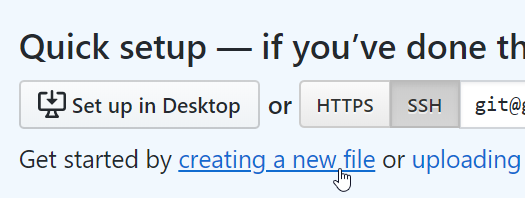
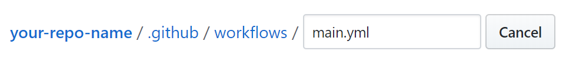
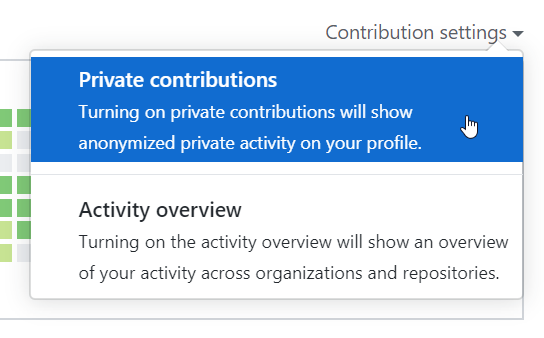
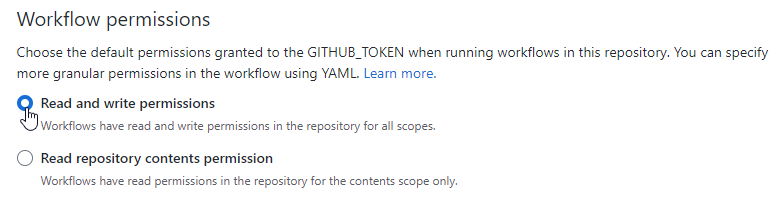

<p align="center">
  
</p>

<h1 align="center">
  Contribution Graph Action
</h1>

<p align="center">
  <a href="https://github.com/bcanseco/github-contribution-graph-action/actions?query=workflow%3Abuild">
    
  </a>

  <a href="https://github.com/bcanseco/github-contribution-graph-action/actions?query=workflow%3Atests">
    
  </a>

  <a href="https://github.com/bcanseco/github-contribution-graph-action/actions?query=workflow%3Aaudit">
    
  </a>

  <a href="https://github.com/marketplace/actions/autopopulate-your-contribution-graph">
    
  </a>

  <a href="https://github.com/bcanseco/github-contribution-graph-action/releases">
    
  </a>
</p>

> Maybe most of your coding happens on another version control host, like GitLab or Bitbucket. Maybe your company uses GitHub Enterprise but hasn't enabled [unified contributions](https://docs.github.com/en/enterprise-server@latest/admin/configuration/configuring-github-connect/enabling-unified-contributions-for-your-enterprise). Maybe you're looking for a new software development job and are worried that recruiters will prejudge you by your scarce contribution graph.  
> Or maybe you have [other reasons](https://twitter.com/jacobmparis/status/1265740598277025792). Whatever the case may be, you've come to the right place.

## Quick start without leaving your browser ⚡

1. [Create a new repo](https://github.com/new) (preferably private unless you have no shame)
1. Click on **Create a new file**  
   
1. In the **Name your file...** field, type in `.github/workflows/main.yml`
   
1. Paste in one of the YAML file contents below, depending on what you want to do. Be sure to update `GIT_EMAIL`.
1. Click the **Commit new file** button at the bottom of the page. You're all set!
   * Note that you must enable the option below in your contribution settings for private commits to count on the graph.
   

If you change your mind about these commits later, you can delete the repository and they'll disappear from your contribution graph.

### Push a commit to GitHub once a day 🍺

```yml
# .github/workflows/main.yml

on:
  schedule:
  - cron: '0 12 * * *' # every day at noon

jobs:
  single-commit:
    runs-on: ubuntu-latest
    permissions:
      contents: write
    steps:
    - uses: bcanseco/github-contribution-graph-action@v2
      env:
        GITHUB_TOKEN: ${{ secrets.GITHUB_TOKEN }}
        GIT_EMAIL: you@youremail.com # replace me
```

If you need help with cron job syntax, [crontab guru](https://crontab.guru/) is a great resource.

### Backfill a year of commits whenever you push to GitHub 🍻

This rolls a pseudorandom number generator between 1 and 5 (inclusive) to determine how many commits to make per-day.

```yml
# .github/workflows/main.yml

on: push

jobs:
  backfill-commits:
    runs-on: ubuntu-latest
    permissions:
      contents: write
    steps:
    - uses: bcanseco/github-contribution-graph-action@v2
      env:
        GITHUB_TOKEN: ${{ secrets.GITHUB_TOKEN }}
        GIT_EMAIL: you@youremail.com # replace me
        MAX_DAYS: 365
        MIN_COMMITS_PER_DAY: 1
        MAX_COMMITS_PER_DAY: 5
```

Keep reading for more cool stuff like:

* skipping weekends/weekdays
* backfilling specific time periods
* custom commit messages
* and more!

## Environment variables 🌳

| Key                   | Description                                                                                                                    | Default value                                         | Required? |
|-----------------------|--------------------------------------------------------------------------------------------------------------------------------|-------------------------------------------------------|-----------|
| `GITHUB_TOKEN`        | Allows this GitHub Action to make commits for you. Simply pass in `${{ secrets.GITHUB_TOKEN }}`. [Read more](#github_token-).  |                                                       |    🟩     |
| `GIT_EMAIL`           | An email address associated with your GitHub account. Without this, contributions won't show up. [Read more](#git_email-).     |                                                       |    🟩     |
| `GIT_BRANCH`          | Must either be the default branch or `gh-pages` for contributions to show up.                                                  | The branch that triggered this Github Action          |           |
| `GIT_COMMIT_MESSAGE`  | The message to use for commits made by this GitHub Action.                                                                     | `chore(actions): empty commit for contribution graph` |           |
| `ORIGIN_TIMESTAMP`    | The unix timestamp to start commits on. If you set `MAX_DAYS` greater than 1, commits will be made on days prior to this time. | The current timestamp                                 |           |
| `MAX_DAYS`            | The maximum integer number of days to commit on. If you want to backfill a year of commits, set this to `365`.                 | `1`                                                   |           |
| `MIN_COMMITS_PER_DAY` | The minimum integer number of commits to make per day (inclusive). Used by a pseudo-RNG.                                       | `1`                                                   |           |
| `MAX_COMMITS_PER_DAY` | The maximum integer number of commits to make per day (inclusive). Used by a pseudo-RNG.                                       | `1`                                                   |           |
| `INCLUDE_WEEKDAYS`    | A boolean indicating whether or not to make commits on weekdays.                                                               | `true`                                                |           |
| `INCLUDE_WEEKENDS`    | A boolean indicating whether or not to make commits on weekends.                                                               | `true`                                                |           |
| `FORCE_PUSH`          | A boolean indicating whether or not to force push. **WARNING:** Setting this to `true` will clear out your repo on each run!   | `false`                                               |           |

### Advanced environment variables 🧙‍♂️

<details>

<summary>There's also some advanced environment variables you can provide. Click here!</summary>

Only set these if you know what you're doing:

| Key                 | Description                                                                  | Default value                                                     | Required? |
|---------------------|------------------------------------------------------------------------------|-------------------------------------------------------------------|-----------|
| `GIT_HOST`          | You may be able to override this to support a GitHub Enterprise environment. | `github.com`                                                      |           |
| `GIT_SSH_COMMAND`   |                                                                              | `ssh -o UserKnownHostsFile=/dev/null -o StrictHostKeyChecking=no` |           |
| `GITHUB_ACTOR`      |                                                                              | Set by the GitHub Actions runner                                  |           |
| `GITHUB_REPOSITORY` |                                                                              | Set by the GitHub Actions runner                                  |           |

</details>

## How do I know this is secure? 🔒

Explore the [code](src/index.js)! It's tiny and there aren't many dependencies.

Speaking of dependencies, all production npm dependencies used by this GitHub Action are [automatically audited](./.github/workflows/audit.yml) for vulnerabilities. If the badge at the top of this README is green, you're good to go.

If you're still worried about malicious code in this repository, GitHub recommends always using a specific version of any GitHub Actions you add to your repositories. [Read more](https://docs.github.com/en/actions/using-workflows/workflow-syntax-for-github-actions#jobsjob_idstepsuses).

```diff
- uses: bcanseco/github-contribution-graph-action@v2
+ uses: bcanseco/github-contribution-graph-action@2.0.0
```

As far as data security, there's two sensitive pieces of data that this Action handles:

* [`GITHUB_TOKEN`](#github_token-)
* [`GIT_EMAIL`](#git_email-)

### `GITHUB_TOKEN` 🔑

GitHub has [a great article](https://docs.github.com/en/actions/security-guides/automatic-token-authentication#using-the-github_token-in-a-workflow) about the token. It's the standard way that all GitHub Actions interact with GitHub on your behalf. The permissions of this token are both short-lived and scoped to one repo only.

You don't need to create this secret yourself; GitHub handles that for you. All you need to do is provide the token in your workflow, job, or step:

```yml
env:
  GITHUB_TOKEN: ${{ secrets.GITHUB_TOKEN }}
```

#### Getting 403 errors? ❌

Make sure your token has [write permission for the `contents` scope](https://docs.github.com/en/actions/using-jobs/assigning-permissions-to-jobs). If you're using the examples in this README, this is already done for you.

You can alternatively set this as a repo-level default:



### `GIT_EMAIL` 📧

This GitHub Action requires an email associated with your GitHub account. If you provide a random or throwaway email, contributions won't show up on your GitHub profile. [Read more](https://docs.github.com/en/account-and-profile/setting-up-and-managing-your-github-profile/managing-contribution-settings-on-your-profile/why-are-my-contributions-not-showing-up-on-my-profile#you-havent-added-your-local-git-commit-email-to-your-profile).

Chances are, your email is already public if you're making commits with it. But if you're concerned about privacy, you can do either of the following:

* [Add your email as a secret](https://docs.github.com/en/actions/security-guides/encrypted-secrets#creating-encrypted-secrets-for-a-repository) and pass it in the same way as the `GITHUB_TOKEN`
* [Use your GitHub-provided `noreply` email address](https://docs.github.com/en/account-and-profile/setting-up-and-managing-your-personal-account-on-github/managing-email-preferences/setting-your-commit-email-address#about-commit-email-addresses)

## Contribute 👪

PRs are welcome! Please read the [contributing guide](.github/CONTRIBUTING.md). This project is [MIT](LICENSE) licensed.
