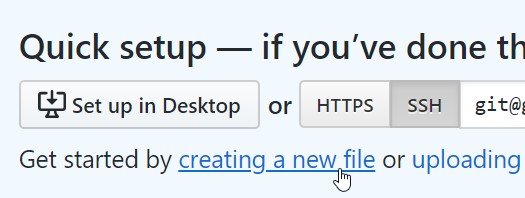
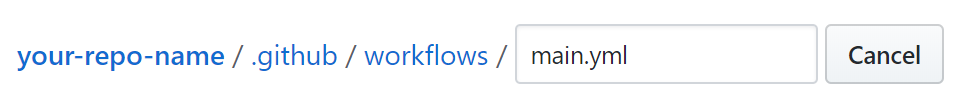
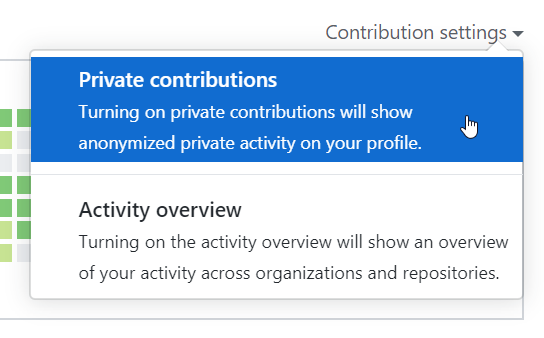

<p align="center">
  
</p>

<h1 align="center">Contribution Graph Action</h1>

<p align="center">
  <a href="https://github.com/bcanseco/github-contribution-graph-action/actions?query=workflow%3Abuild">
    
  </a>
  <a href="https://github.com/bcanseco/github-contribution-graph-action/actions?query=workflow%3Atests">
    
  </a>
  <a href="https://github.com/bcanseco/github-contribution-graph-action/actions?query=workflow%3Aaudit">
    
  </a>
  <a href="https://github.com/marketplace/actions/autopopulate-your-contribution-graph">
    
  </a>
  <a href="https://github.com/bcanseco/github-contribution-graph-action/releases">
    
  </a>
</p>

> Are you coding on another version control system like GitLab or Bitbucket? Perhaps your company uses GitHub Enterprise without enabling [unified contributions](https://docs.github.com/en/enterprise-server@latest/admin/configuration/configuring-github-connect/enabling-unified-contributions-for-your-enterprise). Or maybe you're searching for a new role and want to enhance your GitHub profile.  
> Whatever your reason, this GitHub Action helps you fill your contribution graph effortlessly.

---

## 🚀 Quick Start Without Leaving Your Browser ⚡

1. [Create a new repository](https://github.com/new) (private is recommended unless you’re okay with the visibility).
2. Click **Create a new file**  
   
3. In the **Name your file...** field, type `.github/workflows/main.yml`  
   
4. Paste one of the YAML examples below (and don't forget to set `GIT_EMAIL`).
5. Click **Commit new file** to save changes.

> **Note:** Enable this option in your profile settings to ensure private contributions count.  
> 

If you later decide to remove these commits, simply delete the repository, and they will disappear from your contribution graph.

---

### 🍺 Push a Commit to GitHub Once a Day

```yml
# .github/workflows/main.yml

on:
  schedule:
    - cron: '0 12 * * *' # Every day at noon

jobs:
  single-commit:
    runs-on: ubuntu-latest
    permissions:
      contents: write
    steps:
      - uses: bcanseco/github-contribution-graph-action@v2
        env:
          GITHUB_TOKEN: ${{ secrets.GITHUB_TOKEN }}
          GIT_EMAIL: you@youremail.com # Set your email
```

Need help with cron job syntax? Try [crontab guru](https://crontab.guru/).

---

### 🍻 Backfill a Year of Commits When You Push to GitHub

This script generates 1-5 commits per day using a pseudorandom number generator.

```yml
# .github/workflows/main.yml

on: push

jobs:
  backfill-commits:
    runs-on: ubuntu-latest
    permissions:
      contents: write
    steps:
      - uses: bcanseco/github-contribution-graph-action@v2
        env:
          GITHUB_TOKEN: ${{ secrets.GITHUB_TOKEN }}
          GIT_EMAIL: you@youremail.com # Set your email
          MAX_DAYS: 365
          MIN_COMMITS_PER_DAY: 1
          MAX_COMMITS_PER_DAY: 5
```

---

## 🌳 Environment Variables

| Key                   | Description                                                                                     | Default Value                                         | Required? |
|-----------------------|-------------------------------------------------------------------------------------------------|-----------------------------------------------------|-----------|
| `GITHUB_TOKEN`        | Token for this Action to make commits. Use `${{ secrets.GITHUB_TOKEN }}`. [Read more](#github_token). |                                                     | 🟩        |
| `GIT_EMAIL`           | Your GitHub-associated email address for contributions to appear. [Read more](#git_email).     |                                                     | 🟩        |
| `GIT_BRANCH`          | Branch for commits (default branch or `gh-pages`).                                             | Triggering branch                                    |           |
| `GIT_COMMIT_MESSAGE`  | Commit message used by this Action.                                                            | `chore(actions): empty commit for contribution graph` |           |
| `MAX_DAYS`            | Number of days to backfill commits.                                                            | `1`                                                 |           |
| `MIN_COMMITS_PER_DAY` | Minimum commits per day (inclusive).                                                           | `1`                                                 |           |
| `MAX_COMMITS_PER_DAY` | Maximum commits per day (inclusive).                                                           | `1`                                                 |           |

For advanced configuration, check out the [full list of variables](#advanced-environment-variables).

---

## 🔒 How Secure Is This?

- **Code**: The [source code](src/index.js) is simple and transparent.  
- **Dependencies**: All dependencies are [audited automatically](./.github/workflows/audit.yml) for vulnerabilities.  
- **Versioning**: Always use a specific version of this Action for added security.  
  ```yml
  - uses: bcanseco/github-contribution-graph-action@2.0.0
  ```

---

## 📧 `GIT_EMAIL`

Your email must be associated with GitHub to count contributions. Use your GitHub-provided `noreply` email for privacy if needed. [More info](https://docs.github.com/en/account-and-profile/setting-up-and-managing-your-github-profile/managing-contribution-settings-on-your-profile/why-are-my-contributions-not-showing-up-on-my-profile#you-havent-added-your-local-git-commit-email-to-your-profile).

---

## 👪 Contribute

Contributions are welcome! Check out the [contributing guide](.github/CONTRIBUTING.md).  
This project is licensed under the [MIT License](LICENSE).
